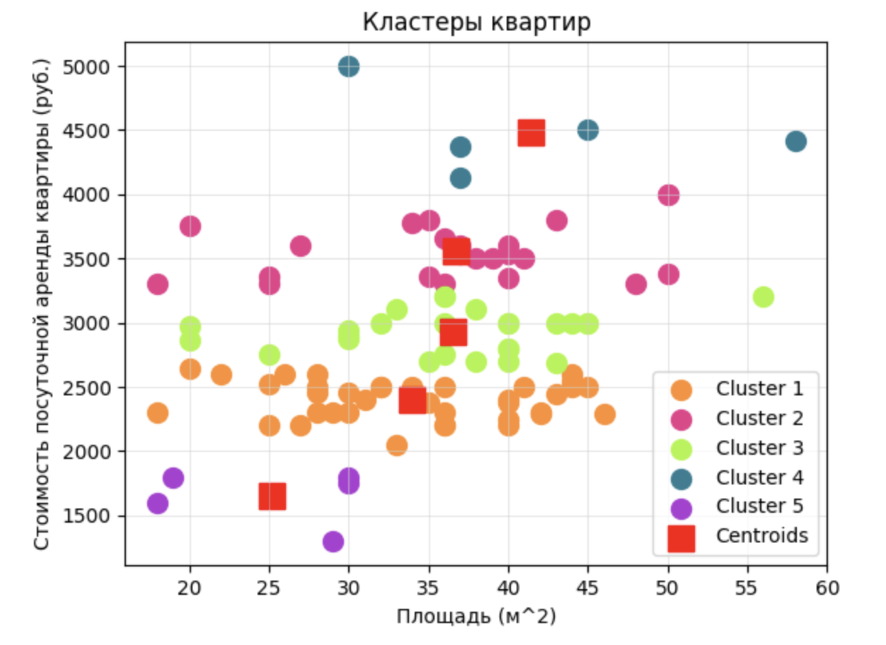

# Кластерный анализ данных об аренде квартир в Иркутске

[](https://python.org)
[](https://jupyter.org)

Проект посвящен изучению и применению метода кластерного анализа K-средних (K-Means) для сегментации рынка аренды квартир в городе Иркутске на основе данных о стоимости и площади.

## Цели и задачи

**Цель:** Изучение кластерного анализа данных на основе метода К-средних.

**Основные задачи:**
*   Получение навыков рефакторинга кода в проектах интеллектуального анализа данных.
*   Изучение принципов определения оптимального количества кластеров в методах кластерного анализа.
*   Изучение возможностей языка Python для реализации кластерного анализа.

## Описание данных

В качестве данных для построения модели кластеризации был выбран набор данных о посуточной аренде квартир в Иркутске. Данные взяты из объявлений пользователей, размещенных на портале Суточно.ру: https://sutochno.ru/.

В наборе присутствуют признаки:

* `Район`: Район города, в котором располагается квартира (Октбрьский, Правобережный, Свердловский);
* `Ремонт`: Вид реонта в квартире (евро, дизайнерский, косметический);
* `Этаж`: Этаж, на котором располагается квартира (Нижний, Средний, Верхний);
* `Парковка`: Наличие парковки рядо с домом (да, нет);
* `Лифт`: Наличие лифта в доме (да, нет);
* `Стоимость,руб./сут.`: Стоимость посуточной аренды квартиры в руб.;
* `Предоплата,руб.`: Размер предоплаты в руб.;
* `Площадь, м^2`: Площадь квартиры в м^2.
  
Набор содержит 96 записей и актуальны на 12.02.2024.

Для кластеризации использовались признаки **"Стоимость, руб./сут."** и **"Площадь, м^2"**.

**Пример первых строк данных:**
```csv
№,Район,Стоимость, руб./сут.,Предоплата, руб.,Площадь, м^2,Этаж,Ремонт,Парковка,Лифт
2,Октябрьский,2520,630,25,Верхний,евроремонт,да,да
3,Октябрьский,2300,460,30,Верхний,евроремонт,да,да
4,Октябрьский,3300,660,48,Верхний,евроремонт,да,да
...
```

## Результаты кластеризации

Метод кластеризации K-средних был использован для разделения данных на 5 групп (кластеров).

Графическое представление кластеров позволяет визуально оценить, как распределяются квартиры по двум рассматриваемым параметрам:

*   **Кластер 1 (оранжевый: #FF8E30):** Включает в себя квартиры с низкой стоимостью аренды и маленькой или средней площадью. Это может быть группа доступных для аренды объектов.
*   **Кластер 2 (розовый: #EB3B8B):** Здесь находятся квартиры с более высокой стоимостью аренды, они имеют средние или большие площади. Это может быть связано с более высококачественными предложениями или дополнительными факторами такими, как более качественный ремонт или лучшее расположение.
*   **Кластер 3 (зеленый: #AAF53D):** В данном кластере представлены квартиры со средней стоимостью аренды, и небольшой или средней площадью. Это может быть распространенный вариант, который удовлетворяет среднему классу потребителей.
*   **Кластер 4 (синий: #AF3BD4):** Квартиры с высокой стоимостью аренды и большой площадью. Это может соответствовать более элитным предложениям, которые располагаются в лучших районах.
*   **Кластер 5 (фиолетовый: #2B7D93):** Этот кластер содержит квартиры с низкой ценой и маленькой площадью. Он соответствует наиболее бюджетным предложениям.

На графике также показаны центры кластеров (в красных квадратных метках). Эти центры представляют собой средние значения по двум переменным для квартир в каждом кластере. Они позволяют быстро оценить, каков типичный экземпляр из каждого кластера.



Таким образом, результаты кластеризации предоставляют полезную информацию о распределении предложений на аренду в Иркутске. Каждый кластер характеризуется определенными параметрами цены и площади, что может помочь как арендаторам в нахождении подходящих предложений, так и арендодателям в понимании сегментации рынка.

## Технологии

*   **Python 3**
*   **Pandas** - для обработки и анализа данных
*   **Scikit-learn (sklearn)** - для реализации алгоритма K-Means
*   **Matplotlib / Seaborn** - для визуализации результатов
